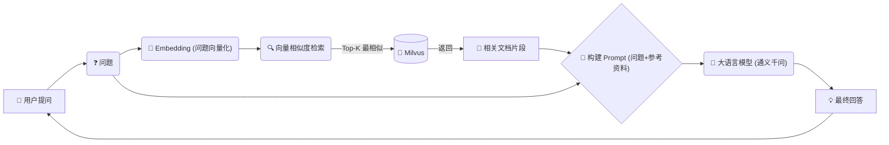

# AI Vector Database & RAG System：从零构建企业级智能知识库

## 📖 项目介绍 (Project Introduction)

欢迎来到 **AI Vector Database & RAG System** 项目。

如果你是一个 AI 领域的初学者，或者是一位想要从传统的 Web 开发转型为 AI 应用开发的工程师，本项目将是你最好的起点。

本项目演示了如何结合 **Milvus**（全球最流行的开源向量数据库）、**LangChain**（大模型应用开发框架）和 **DashScope**（通义千问大模型），构建一个**私有知识库问答系统**。

### ✨ 你将收获什么？

*   🎓 **从小白到入门**：用通俗易懂的语言理解 RAG、向量数据库、Embedding 等核心概念。
*   🏗️ **完整的架构视野**：不只是代码片段，而是完整的前后端分离架构（Vue3 + Flask + Milvus）。
*   🔍 **逐行代码拆解**：我们将像"逐字稿"一样，带你读懂核心代码，理解每一行背后的思考。
*   🛠️ **实战技能**：掌握文档切分、向量存储、混合检索、Prompt 工程等 AI 开发必备技能。

---

## 🎓 核心概念：小白也能懂 (Concepts 101)

在深入代码之前，让我们先搞懂几个关键概念。

### 1. 什么是 RAG (检索增强生成)？
**RAG (Retrieval-Augmented Generation)** 是目前解决大模型"胡说八道"（幻觉）和"知识过时"问题的最佳方案。

*   **通俗比喻**：
    *   **大模型 (LLM)** 就像一个**"超级学霸"**，他读过很多书，但他的知识截止到他毕业（训练结束）的那一天，而且他不知道你公司的内部秘密。
    *   **RAG** 就像是给学霸发了一本**"开卷考试的参考书"**（你的私有文档）。
    *   当用户提问时，系统先去书里翻到相关的几页（检索），然后把这几页纸连同问题一起递给学霸。学霸结合书里的内容，就能回答出准确的、关于你公司的答案了。

### 2. 什么是 Milvus (向量数据库)？
*   **通俗比喻**：
    *   如果说 MySQL 是**"Excel 表格"**，专门存结构化的行和列；
    *   那么 Milvus 就是一个**"高维图书馆"**。它存储的不是具体的文字，而是文字的**"语义坐标"**。它能以毫秒级的速度，从数亿条数据中找到和你的问题"长得最像"（语义最接近）的那些片段。

### 3. 什么是 Embedding (向量化)？
*   **通俗比喻**：
    *   计算机不认识字，只认识数字。
    *   Embedding 就是一个**"翻译官"**，它把一段文字（如"苹果"）翻译成一串长长的数字列表（如 `[0.12, -0.56, 0.99, ...]`）。
    *   神奇的是，在这个数字空间里，意思相近的词，距离会很近。比如"苹果"和"水果"的向量距离很近，但"苹果"和"汽车"的距离就很远。Milvus 就是靠计算这个距离来寻找答案的。

---

## 🧩 系统架构与流程 (Architecture)

### 1. 数据入库流程 (Ingestion Pipeline)
这是知识库的"消化系统"。我们将文档吃进去，嚼碎（切分），转化成营养（向量），存入身体（Milvus）。


### 2. 问答检索流程 (RAG Pipeline)
这是知识库的"大脑反应"。



---

## 🚀 快速开始 (Quick Start)

### 前端运行 (Frontend)
前端主要负责展示界面，核心逻辑在后端。

```bash
cd rag_front
npm install
npm run dev
```
*访问 `http://localhost:5173` 即可看到聊天界面。*

---

## 🔍 核心代码深度拆解 (Deep Dive)

这里是文档的**最核心部分**。我们将深入 `example/vector_databases` 目录下的 Python 代码。

### 📝 第一部分：向量数据库大管家 (`vector_db_manager.py`)

这个文件负责跟 Milvus 打交道，主要包含三个动作：**连接、切分、入库**。

#### 1. 初始化与连接
```python
class VectorDatabaseManager:
    def __init__(self, ...):
        # 1. 初始化 Embedding 模型
        # 我们使用 DashScope (通义千问) 的 embedding 服务
        # 它的作用是把文字变成向量
        self.embeddings = DashScopeEmbeddings(
            model=self.embedding_model,
            dashscope_api_key=self.dashscope_api_key
        )
        
        # 2. 初始化文本切分器 (Text Splitter)
        # 为什么要切分？
        # 因为大模型一次能读的内容有限（Context Window 限制）。
        # 如果把整本书都塞进去，既费钱又容易超长。
        # 所以我们要把大文档切成一个个 500 字左右的小块。
        self.text_splitter = RecursiveCharacterTextSplitter(
            chunk_size=500,       # 每个块的大小
            chunk_overlap=50,     # 重叠部分，防止一句话被切成两半，上下文丢失
            separators=["\n\n", "\n", "。", "！"] # 优先按段落切，再按句子切
        )
        
        # 3. 连接 Milvus
        # 建立与 Milvus 服务器的 TCP 连接
        connections.connect("default", host=self.milvus_host, port=self.milvus_port)
```

#### 2. 文档处理全流程 (`process_file`)
这是你上传文件时系统在做的事情。
```python
def process_file(self, file_path: str, collection_name: str = None) -> bool:
    # 第一步：加载 (Load)
    # 根据文件后缀 (.txt, .pdf) 自动选择加载器读取文字
    documents = self.load_document(file_path)
    
    # 第二步：切分 (Split)
    # 调用上面定义的 text_splitter，把长文档切成几百个小片段
    split_docs = self.split_documents(documents)
    
    # 第三步：入库 (Store)
    # 最关键的一步，将片段转成向量存入 Milvus
    self.add_documents_to_db(split_docs, collection_name)
    
    return True
```

#### 3. 核心入库逻辑 (`add_documents_to_db`)
这里展示了如何优雅地处理 Milvus 集合的创建与追加。
```python
def add_documents_to_db(self, documents: List[Document], collection_name: str = None):
    # 检查集合是否已经存在
    if collection_exists:
        # 如果存在，我们创建一个 Milvus 实例并指向它
        self.vectorstore = Milvus(
            embedding_function=self.embeddings,
            collection_name=target_collection,
            ...
        )
        # 【追加模式】：直接把新文档加进去
        self.vectorstore.add_documents(documents)
    else:
        # 如果不存在，这是第一次创建
        # 【创建模式】：Milvus.from_documents 会自动分析文档结构
        # 创建新的集合，定义 Schema（字段结构），并插入数据
        self.vectorstore = Milvus.from_documents(
            documents=documents,
            embedding=self.embeddings,
            collection_name=target_collection,
            ...
        )
```

---

### 🧠 第二部分：智能检索与问答 (`vector_retriever.py`)

这个文件是 RAG 的"大脑"，它负责理解你的问题，并组织答案。

#### 1. 相似度搜索 (`search_similar_content`)
这是"在书里翻页"的过程。
```python
def search_similar_content(self, query: str, ...):
    # 这里的 search 方法会做两件事：
    # 1. 把你的问题 query (例如"公司的报销流程是怎样的？") 变成向量。
    # 2. 在 Milvus 里计算这个向量和库里几亿个向量的"余弦相似度"。
    # 3. 返回得分最高的前 K 个文档块。
    search_results = self.db_manager.search(query=query, k=k, ...)
    
    # 过滤低质量结果
    # 如果最相似的文档得分都很低（比如 < 0.5），说明库里可能根本没有相关知识
    # 这时候我们可能需要告诉 LLM "我不知道"，防止强行回答
    results = [doc for doc, score in search_results if score >= self.similarity_threshold]
    return results
```

#### 2. 生成回答 (`answer_question`)
这是 RAG 的完整闭环。
```python
def answer_question(self, question: str, ...):
    # 1. 检索：先去 Milvus 找资料
    relevant_docs = self.search_similar_content(question, ...)
    
    # 2. 构建上下文 (Context Construction)
    # 把找到的资料拼成一段话
    # 例如：
    # 参考资料1: 公司报销需要填写 A 单据...
    # 参考资料2: 报销必须在每月 5 号前提交...
    context = "\n\n".join([doc.page_content for doc in relevant_docs])
    
    # 3. 呼叫大模型 (LLM Generation)
    answer = self._generate_answer_with_llm(question, context)
    return answer
```

#### 3. Prompt 工程 (提示词)
这是让大模型听话的关键。
```python
# System Prompt (系统人设)
# 我们明确告诉模型：你必须基于【参考资料】回答，不要瞎编。
system_prompt = (
    "你是一个智能助手。请基于提供的【参考资料】回答用户的问题。\n"
    "如果参考资料为空或与问题无关，请忽略参考资料，利用你的通用知识进行回答，"
    "并在回答开头说明：'知识库中未找到相关内容，以下是基于通用知识的回答：'。\n"
    "回答要简洁、准确、有条理。"
)

# User Prompt (用户输入)
# 我们把问题和资料打包发给它
user_prompt = f"问题：{question}\n\n【参考资料】：\n{context}"
```

---

## ❓ 常见问题 (FAQ)

**Q1: 为什么我的文档上传了，但是搜不到？**
*   **原因 1**：文档太短或格式乱码，导致 Document Loader 没读出内容。
*   **原因 2**：Milvus 还没把数据刷入磁盘（Flush），虽然我们的代码处理了自动刷新，但偶尔会有延迟。
*   **原因 3**：切分问题。如果关键词被切分到了两个块里，可能导致语义不连贯。

**Q2: Milvus 和 MySQL 能混用吗？**
*   **最佳实践**：通常我们将**向量数据**（Feature Vectors）存 Milvus，而将**元数据**（Metadata，如文件名、上传者、时间）存 MySQL。然后通过 ID 进行关联。本项目为了简化，直接将少量元数据存在了 Milvus 的 Metadata 字段中。

**Q3: `k=5` 是什么意思？**
*   `k` 代表 **Top-K**，即每次检索返回最相似的 5 个片段。
*   `k` 太小：可能漏掉关键信息。
*   `k` 太大：可能引入无关信息（噪音），干扰大模型判断，且浪费 Token 费用。通常 3-5 是比较好的选择。
