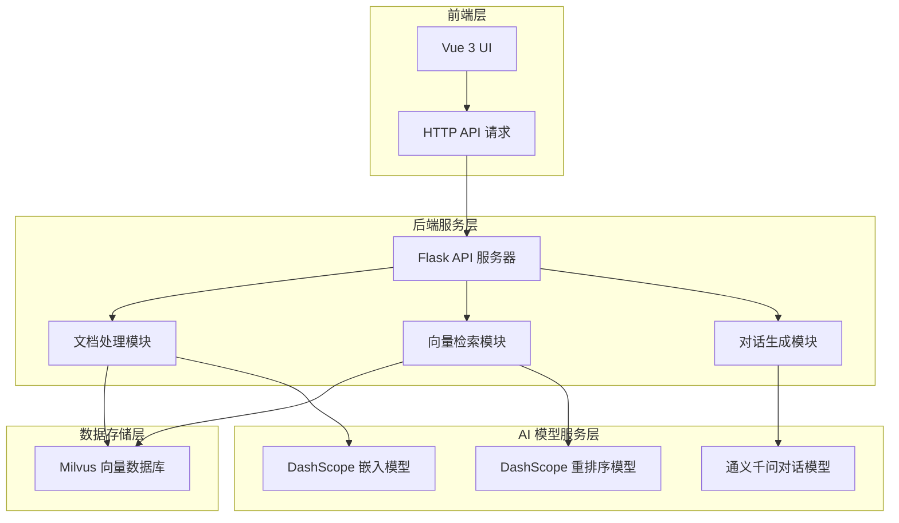

# AI Vector Database & RAG System

**AI Vector Database & RAG System** 
这是一个基于 **Milvus 向量数据库** 和 **通义千问大模型** 构建的智能私有知识库问答系统，能够帮助用户快速构建专属的知识库并进行智能问答。

## ✨ 项目亮点

### 🔑 核心技术优势
- **Milvus 向量数据库** - 全球领先的开源向量数据库，提供高效的相似性搜索能力
- **通义千问大模型** - 阿里巴巴通义实验室开发的先进大语言模型，支持多场景应用
- **DashScope API** - 阿里云提供的模型服务，包含高质量的嵌入模型和重排序模型
- **LangChain 框架** - 强大的大模型应用开发框架，简化复杂AI应用构建过程

### 🧠 智能化功能特性
- **多格式文档支持** - 支持 PDF、TXT、DOCX、CSV、Excel 等多种文档格式
- **智能文档切分** - 自动将长文档按语义切分，保留上下文完整性
- **HyDE 算法优化** - 通过假设性文档嵌入提升检索准确性
- **多查询生成** - 生成多个查询视角，提高检索召回率
- **智能重排序** - 利用重排序模型优化检索结果相关性
- **实时文档上传** - 支持在线上传文档并立即生效
- **FastMCP 接口** - 封装了知识库检索和LLM问答功能，便于集成到其他AI助手系统

### 🖥️ 前后端分离架构
- **Vue 3 + Element Plus** - 现代化前端界面，提供流畅的用户体验
- **Flask 后端服务** - 轻量级后端框架，RESTful API 设计
- **跨域支持** - 无缝前后端通信

## 🚀 快速开始

### 环境准备

确保您的系统已安装以下软件：
- Python 3.8+
- Node.js 20+
- Milvus 向量数据库服务

### 配置步骤

1. **克隆项目**
```bash
git clone <your-repo-url>
cd rag_agent
```

2. **安装后端依赖**
```bash
pip install -r requirements.txt
```

3. **配置 API 密钥**
在 `config/rag.yml` 文件中设置您的 DashScope API 密钥：
```yaml
dashscope_api_key: your_dashscope_api_key_here
```

4. **启动后端服务**
```bash
python rag/server.py
```
服务将运行在 `http://localhost:5000`

5. **启动前端服务**
```bash
cd rag_front
npm install
npm run dev
```
前端界面将运行在 `http://localhost:5173`

### 启动 FastMCP 服务器（可选）
如果您希望将此RAG系统作为服务集成到其他AI助手，可以启动FastMCP服务器：
```bash
python mcp/mcp_server.py
```
服务器将运行在 `http://127.0.0.1:8001`

## 🛠️ 主要功能

### 文档管理
- **批量上传** - 支持同时上传多个文档
- **MD5 校验** - 避免重复文档上传
- **自动解析** - 支持多种格式文档的自动解析

### 智能检索
- **多查询生成** - 使用大模型生成多个语义相同但表达不同的查询语句，从不同角度检索相关信息
- **假设性文档嵌入 (HyDE)** - 生成假设性文档回答，然后用其嵌入来检索实际相关文档
- **混合检索** - 结合多种检索策略的结果，并使用倒数排名融合(RRF)或交叉编码器重排序优化最终结果
- **向量检索** - 基于语义相似性的高效向量检索
- **结果重排序** - 使用重排序模型优化检索结果

### 对话增强
- **RAG 对话** - 结合外部知识的对话生成
- **上下文感知** - 维护对话历史，提供连贯回答
- **引用标注** - 明确标注答案来源，增强可信度

## 🔧 配置说明

项目配置位于 `config/rag.yml`，主要包括：
- **Milvus 连接参数** - 主机地址、端口等
- **模型配置** - 嵌入模型、对话模型、重排序模型
- **文档处理参数** - 切分大小、重叠长度等
- **检索参数** - Top-K 数量、重排序数量等

## 📊 系统架构



## 🤝 贡献指南

欢迎提交 Issue 和 Pull Request 来改进项目！

## 📄 许可证

本项目采用 MIT 许可证。