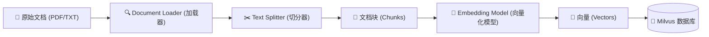
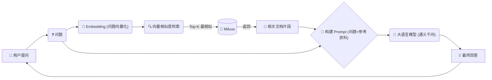

# AI Vector Database & RAG System：从零构建企业级智能知识库

欢迎来到 **AI Vector Database & RAG System** 项目。

本项目演示了如何结合 **Milvus**（全球最流行的开源向量数据库）、**LangChain**（大模型应用开发框架）和 **DashScope**（通义千问大模型），构建一个**私有知识库问答系统**。


## 🧩 系统架构与流程 (Architecture)

### 1. 数据入库流程 (Ingestion Pipeline)
这是知识库的"消化系统"。我们将文档吃进去，嚼碎（切分），转化成营养（向量），存入身体（Milvus）。



### 2. 问答检索流程 (RAG Pipeline)
这是知识库的"大脑反应"。



---

## 🚀 快速开始 (Quick Start)

### 前端运行 (Frontend)
前端主要负责展示界面，核心逻辑在后端。

```bash
cd rag_front
npm install
npm run dev
```
*访问 `http://localhost:5173` 即可看到聊天界面。*

### 后端运行 (Backend)
后端主要负责处理用户请求，调用大模型，与数据库交互。

```bash
pip install -r requirements.txt
python rag/server.py
```
*访问 `http://localhost:5000` 即可看到后端日志。*